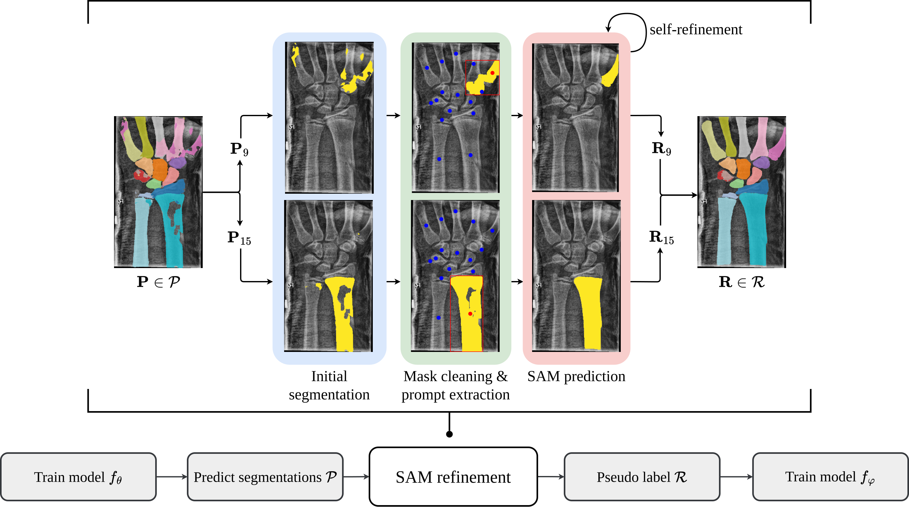

# SAM Carries the Burden: A Semi-Supervised Approach Refining Pseudo Labels for Medical Segmentation

## Overview
We propose a method that leverages initial imprecise segmentation masks to provide domain knowledge within prompt-based segmentation foundation models.
Our pipeline enables the Segment Anything Model (SAM) for pseudo label refinement in a semi-supervised setting. With our automatic generation of prompting, SAM refines initial segmentation masks derived from a limited amount of labelled data and thus provides pseudo labels, enabling unlabelled data for training.



## Implementation
This repository contains code from the [official SAM repository](https://github.com/facebookresearch/segment-anything). Please give them credit for sharing their amazing work.

This instruction will explain how to reproduce the results exemplary for the GrazPedWri Dataset.
For the other dataset, please refer to the branch `addional_ds` and for the implementation of the comparison methods, please refer to the branch `master`.
We rely on Clear-ML to manage and store our different models.
While it is possible, to rewrite the code to not use Clear-ML and store the models locally, we recommend to use Clear-ML since their free-plan is sufficient to reproduce our results.

### Environment
Our code is implemented in PyTorch.
Please use the provided yaml (environment.yml) file to create the environment.

```bash
conda env create -f environment.yml
```

### GrazPedWriDataset
Please download the dataset using the provided link in the original [paper](https://www.nature.com/articles/s41597-022-01328-z) and preprocess it with their provided notebooks to obtain the 8-bit images. After this, please use our provided preprocessing script `scripts/copy_and_process_graz_imgs` to create the homogeneous dataset (all images flipped to left).
Our radiologists' segmentation mask of 64 representative images were annotated in CVAT and are stored in the `annotations_*.xml` files.
The decoding is done by our custom `utils.cvat_parser`, which is already used in our PyTorch dataset implementation `scripts.seg_gratpedwri_dataset.py`.

### Proposed pipeline (refer to Figure 1 in the paper)
To train our initial U-Net $f_\theta$, run `python -m unet_training.training --gpu_id 0` leaving all the hyperparameters on default.
Next, we predict our initial, unrefined segmentation masks for our unlabelled data by using `python -m scripts.save_segmentations`, where you have to adjust the model id in line 19 to your clear-ml model id (in the clearml experiments: artefacts → output models → bone_segmentator).

To use SAM to refine the segmentation masks, we have to set up two things first:
1. Download the model checkpoint for the ViT-H from the [official repository](https://github.com/facebookresearch/segment-anything?tab=readme-ov-file#model-checkpoints) and place it in the `data` folder.
2. Precompute SAM's image embedding to speed up the refinement process (believe me, you will rerun SAM on the same image at some point, and then you will be happy to have the embeddings precomputed). To do so, run `python -m scripts.save_refined_segmentations`. Please use the same model id as before to load its predictions as initial segmentations.

As a last step, we can train the final U-Net $f_\varphi$ on the refined segmentations. To do so, run `python -m unet_training.training_on_pseudo_labels --gpu_id 0 --pseudo_label sam --prompt1st box --prompt2nd pos_points neg_points --num_train_samples 43` leaving all others hyperparameters on default.
To evaluate the final model, you can reuse the `python -m scripts.save_segmentations` script by adjusting the model id to the final one.
